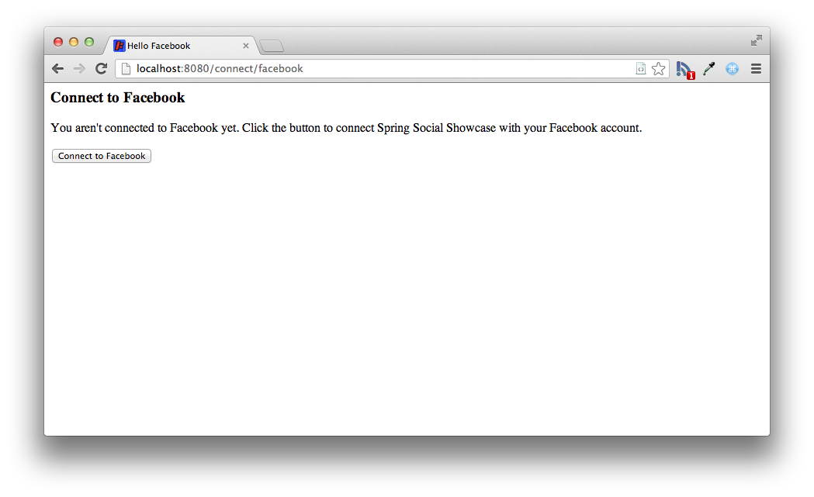
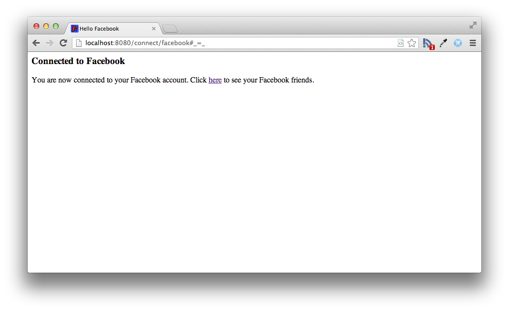

# Getting Started Accessing Facebook Data

What you'll build
-----------------

This guide will take you through creating a simple web application that accesses user data from Facebook, including the user's full name and a list of other Facebook users who they are friends with.

What you'll need
----------------

1. About 15 minutes
1. An application ID and secret obtained from [registering an application with Facebook][register-facebook-app].
- {!include#prereq-editor-jdk-buildtools}

## {!include#how-to-complete-this-guide}

<a name="scratch"></a>
Set up the project
------------------
{!include#build-system-intro}

{!include#create-directory-structure-hello}

### Create a Maven POM

    {!include:initial/pom.xml}

{!include#bootstrap-starter-pom-disclaimer}

<a name="initial"></a>
Enable Facebook
----------------
Before you can fetch a user's data from Facebook, there are a few things that you'll need to set up in the Spring configuration. Here's a configuration class that contains everything you'll need to enable Facebook in your application:

    {!include:complete/src/main/java/hello/FacebookConfig.java}

Since the application will be accessing Facebook data, `FacebookConfig` is annotated with [`@EnableFacebook`][@EnableFacebook]). Notice that, as shown here, the `appId` and `appSecret` attributes have been given fake values. For the code to work, you'll need to [obtain a real application ID and secret][register-facebook-app] and substitute these fake values for the real values given to you by Facebook.

Notice that `FacebookConfig` is also annotated with [`@EnableInMemoryConnectionRepository`][@EnableInMemoryConnectionRepository]. After a user authorizes your application to access their Facebook data, Spring Social will create a connection. That connection will need to be saved in a connection repository for long-term use.

For the purposes of this guide's sample application, an in-memory connection repository is sufficient. Although an in-memory connection repository is fine for testing and small sample applications, you'll want to select a more persistent
option for real applications. You can use [`@EnableJdbcConnectionRepository`][@EnableJdbcConnectionRepository] to persist connections to a relational database.

Within the `FacebookConfig`'s body, there are two beans declared: a `ConnectController` bean and a `UserIdSource` bean.

Obtaining user authorization from Facebook involves a "dance" of redirects between the application and Facebook. This "dance" is formally known as [OAuth][oauth]'s _Resource Owner Authorization_. Don't worry if you don't know much about OAuth. Spring Social's [`ConnectController`][ConnectController] will take care of the OAuth dance for you.

Notice that `ConnectController` is created by injecting a [`ConnectionFactoryLocator`][ConnectionFactoryLocator] and a [`ConnectionRepository`][ConnectionRepository] via the constructor. You won't need to explicitly declare these beans, however. The `@EnableFacebook` annotation will make sure that a `ConnectionFactoryLocator` bean is created and the `@EnableInMemoryConnectionRepository` annotation will create an in-memory implementation of `ConnectionRepository`.

Connections represent a 3-way agreement between a user, an application, and an API provider such as Facebook. Although Facebook and the application itself are readily identifiable, you'll need a way to identify the current user. That's what the `UserIdSource` bean is for. 

Here, the `userIdSource` bean is defined by an inner-class that always returns "testuser" as the user ID. Thus there is only one user of our sample application. In a real application, you'll probably want to create an implementation of `UserIdSource` that determines the user ID from the currently authenticated user (perhaps by consulting with an [`Authentication`][Authentication] obtained from Spring Security's [`SecurityContext`][SecurityContext].)

### Create Connection Status Views

Although much of what `ConnectController` does involves redirecting to Facebook and handling a redirect from Facebook, it also shows connection status when a GET request to /connect is made. It will defer to a view whose name is connect/{provider ID}Connect when no existing connection is available and to connect/{providerId}Connected when a connection exists for the provider. In our case, {provider ID} is "Facebook".

`ConnectController` does not define its own connection views, so you'll need to create them ourselves. First, here's a Thymeleaf view to be shown when no connection to Facebook exists:

    {!include:complete/src/main/resources/templates/connect/facebookConnect.html}

The form on this view will POST to /connect/facebook, which is handled by `ConnectController` and will kick off the OAuth authorization code flow.

Here's the view to be displayed when a connection exists:

    {!include:complete/src/main/resources/templates/connect/facebookConnected.html}


Fetch Facebook data
---------------------
With Facebook configured in your application, you now can write a Spring MVC controller that fetches data for the user who authorized the application and presents it in the browser. `HelloController` is just such a controller:

    {!include:complete/src/main/java/hello/HelloController.java}

`HelloController` is created by injecting a `Facebook` object into its constructor. The `Facebook` object is a reference to Spring Social's Facebook API binding.

The `helloFacebook()` method is annotated with `@RequestMapping` to indicate that it should handle GET requests for the root path (/). The first thing it does is check to see if the user has authorized the application to access their Facebook data. If not, then the user is redirected to `ConnectController` where they may kick off the authorization process.

If the user has authorized the application to access their Facebook data, then it will fetch the user's profile as well as a list of profiles for the user's friends. Both are placed into the model to be displayed by the view identified as "hello".

Speaking of the "hello" view, here it is as a Thymeleaf template:

    {!include:complete/src/main/resources/templates/hello.html}


Make the application executable
-------------------------------

Although it is possible to package this service as a traditional _web application archive_ or [WAR][u-war] file for deployment to an external application server, the simpler approach demonstrated below creates a _standalone application_. You package everything in a single, executable JAR file, driven by a good old Java `main()` method. And along the way, you use Spring's support for embedding the [Tomcat][u-tomcat] servlet container as the HTTP runtime, instead of deploying to an external instance.

### Create a main class

    {!include:complete/src/main/java/hello/Application.java}

The `main()` method defers to the [`SpringApplication`][] helper class, providing `Application.class` as an argument to its `run()` method. This tells Spring to read the annotation metadata from `Application` and to manage it as a component in the _[Spring application context][u-application-context]_.

The `@ComponentScan` annotation tells Spring to search recursively through the `hello` package and its children for classes marked directly or indirectly with Spring's [`@Component`][] annotation. This directive ensures that Spring finds and registers the `GreetingController`, because it is marked with `@Controller`, which in turn is a kind of `@Component` annotation.

The `@Import` annotation tells Spring to import additional Java configuration. Here it is asking Spring to import the `FacebookConfig` class where you enabled Facebook in your application.

The [`@EnableAutoConfiguration`][] annotation switches on reasonable default behaviors based on the content of your classpath. For example, because the application depends on the embeddable version of Tomcat (tomcat-embed-core.jar), a Tomcat server is set up and configured with reasonable defaults on your behalf. And because the application also depends on Spring MVC (spring-webmvc.jar), a Spring MVC [`DispatcherServlet`][] is configured and registered for you — no `web.xml` necessary! Auto-configuration is a powerful, flexible mechanism. See the [API documentation][`@EnableAutoConfiguration`] for further details.

### {!include#build-an-executable-jar}

Running the Service
-------------------------------------

Now you can run it from the jar as well, and distribute that as an executable artifact:
```
$ java -jar target/gs-accessing-facebook-0.1.0.jar

... app starts up ...
```

Once the application starts up, you can point your web browser to http://localhost:8080. Since no connection has been established yet, you should see this screen prompting you to connect with Facebook:



When you click the "Connect to Facebook" button, the browser will be redircted to Facebook for authorization:


At this point, Facebook is asking if you'd like to allow the sample application to access your public profile and list of friends. Click "Okay" to grant permission.

Once permission has been granted, Facebook will redirect the browser back to the application and a connection will be created and stored in the connection repository. You should see this page indicating that a connection was successful:



If you click on the link on the connection status page, you will be taken to the home page. This time, now that a connection has been created, you'll be shown your name on Facebook as well as a list of your friends:


Congratulations! You have just developed a simple web application that uses Spring Social to connect a user with Facebook and to retrieve some data from the user's Facebook profile.

Summary
-------
Congrats! You've just developed a simple web application that obtains user authorization to fetch data from Facebook. 

[zip]: https://github.com/springframework-meta/gs-accessing-facebook/archive/master.zip
[u-war]: /understanding/war
[u-tomcat]: /understanding/tomcat
[u-application-context]: /understanding/application-context
[`SpringApplication`]: http://static.springsource.org/spring-bootstrap/docs/0.5.0.BUILD-SNAPSHOT/javadoc-api/org/springframework/bootstrap/SpringApplication.html
[`@Component`]: http://static.springsource.org/spring/docs/current/javadoc-api/org/springframework/stereotype/Component.html
[`@EnableAutoConfiguration`]: http://static.springsource.org/spring-bootstrap/docs/0.5.0.BUILD-SNAPSHOT/javadoc-api/org/springframework/bootstrap/context/annotation/SpringApplication.html
[`DispatcherServlet`]: http://static.springsource.org/spring/docs/current/javadoc-api/org/springframework/web/servlet/DispatcherServlet.html
[register-facebook-app]: /gs-register-facebook-app/README.md
[@EnableFacebook]: http://static.springsource.org/spring-social-facebook/docs/1.1.x/api/org/springframework/social/facebook/config/annotation/EnableFacebook.html
[@EnableInMemoryConnectionRepository]: TODO
[@EnableJdbcConnectionRepository]: http://static.springsource.org/spring-social/docs/1.1.x/api/org/springframework/social/config/annotation/EnableJdbcConnectionRepository.html
[oauth]: /understanding-oauth
[ConnectController]: http://static.springsource.org/spring-social/docs/1.1.x/api/org/springframework/social/connect/web/ConnectController.html
[ConnectionFactoryLocator]: http://static.springsource.org/spring-social/docs/1.1.x/api/org/springframework/social/connect/ConnectionFactoryLocator.html
[ConnectionRepository]: http://static.springsource.org/spring-social/docs/1.1.x/api/org/springframework/social/connect/ConnectionRepository.html
[Authentication]: http://static.springsource.org/spring-security/site/docs/3.2.x/apidocs/org/springframework/security/core/Authentication.html
[SecurityContext]: http://static.springsource.org/spring-security/site/docs/3.2.x/apidocs/org/springframework/security/core/context/SecurityContext.html
